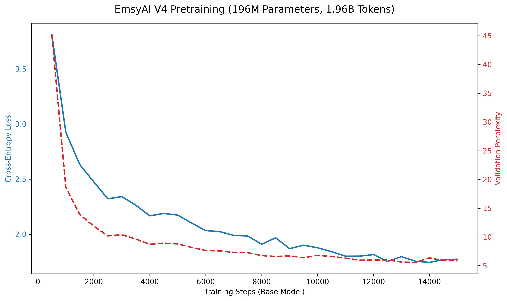

# EmsyAI (V4)

[](https://huggingface.co/gulding/EmsyAI)
[](LICENSE)

EmsyAI is a 196M parameter language model I built from scratch to learn how LLMs actually work under the hood. 

Instead of just fine-tuning an existing model, I wanted to handle the entire pipeline locally: writing a custom BPE tokenizer, building a Llama-style transformer in PyTorch, pretraining it on 2 billion tokens, applying LoRA instruction tuning, and exporting it to GGUF so it runs natively in Ollama.

## 📐 Architecture Evolution

| Specification | EmsyAI V3 (Titan) | EmsyAI V4 (Current) |
|---|---|---|
| **Active Parameters** | 153.8M | **196.7M** (+2.3M LoRA) |
| **Training Tokens** | ~150M | **1.96 Billion** |
| **Context Window** | 4,096 tokens | 4,096 tokens |
| **Hidden Dimension** | 896 | **1,024** |
| **Layers** | 16 | 16 |
| **Attention Mechanism** | GQA (14 Q / 2 KV) | **GQA (16 Q / 4 KV)** |
| **FFN Dimension** | 2,560 (SwiGLU) | **2,816 (SwiGLU)** |
| **Validation Perplexity** | ~14.2 | **5.86** |

## 📉 Pretraining Hardware & Results

Pretrained on 1x NVIDIA RTX GPU (24GB VRAM) using mixed-precision FP16 and AdamW with cosine decay. The model was trained for 15,000 steps. The loss curve behaved surprisingly well, decaying smoothly down to a final validation perplexity of 5.86.



## 🧪 Evaluation & Data Contamination

After pretraining, I fine-tuned the model using LoRA on the ~20k `CodeAlpaca` instruction dataset to teach it the standard `[USER]` / `[MODEL]` prompt format.

**HumanEval pass@1 Score:** `0.0%` *(Expected Baseline)*

*Analysis:* Models that pass HumanEval are typically 40x-350x larger (8B-70B+) and trained on trillions of tokens. For a 196M parameter model, a 0.0% score is mathematically expected and serves as a strict baseline. 

More interestingly, before fine-tuning, I audited the open-source CodeAlpaca dataset for contamination. Using a 13-gram exact match technique, I found 1,644 sequences in CodeAlpaca that perfectly leaked HumanEval test logic (like Heron's formula and prime number checks). Despite this verifiable data leakage in the training set, the model still scored 0.0%—meaning it didn't just blindly overfit or memorize the test set during instruction tuning. It remains an honest, baseline 196M model.

## 💬 Sample Output

Here is an example of how the 196M model responds post-instruction tuning. While it lacks the deep reasoning of a 7B model, it successfully internalizes Python syntax and basic structures.

**Prompt:**
```text
[USER]
Write a python function to check if a number is even.
[MODEL]
```

**Completion (EmsyAI V4):**
```python
def is_even(num):
    if num % 2 == 0:
        return True
    else:
        return False
```

## 💻 How to Run locally

The model is exported to GGUF and can be run instantly via Ollama. Because the `.gguf` file is too large for GitHub (and `.gitignore`d), you'll pull the weights directly from Hugging Face first.

```bash
# Clone the repository
git clone https://github.com/gulding/EmsyAI.git
cd EmsyAI

# Download the V4 GGUF weights from Hugging Face
huggingface-cli download gulding/EmsyAI emsyai-v4-instruct-f32.gguf --local-dir .

# Create and run the Ollama model
ollama create emsyai-v4 -f Modelfile
ollama run emsyai-v4
```

## 🛠️ Lessons Learned (Blueprint for V5)

Building this taught me a lot about transformer stability. Here is what I'm fixing for V5:
1. **QK-Norm:** I ran into severe attention logit explosions during scaling. V5 will inject RMSNorm on the Query and Key states to stabilize training.
2. **Document-Aware Packing:** Currently, the tokenizer blindly concatenates text. V5 will respect document boundaries to prevent cross-document attention poisoning.
3. **Tokenizer Byte Collisions:** I realized late in training that bytes 0-3 currently overlap with special tokens. I'll be rebuilding the tokenizer from scratch and expanding the vocab to 32K.
4. **RoPE Scaling:** Lowering `head_dim` to 64 and adjusting `rope_theta` to 500,000 to better balance high/low frequency positional data at 4096 context.

---
*Built with ❤️ in pure PyTorch.*
